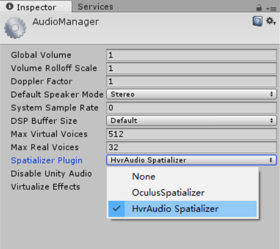

### Unity Audio Spatializer Plugin Programming Guide
 

#### HyperealVR Unity Audio Spatializer Plugin Programming Guide
1.  Currently, the plugin is delivered together with a simple demo scene packaged as a .unitypackage file.  If you would like to import merely the audio spatializer plugin rather than the whole package, please make sure the following files are selected as shown in the picture.
    
     

2.  In order to preview the demo scene, you will also need to import the Hypereal VR plugin for Unity and a set of Hypereal Pano.

3.  Select HvrAudio Spatializer in `Edit->Project Settings->Audio`
    
     

4.  To enable the spatialization effect of a sound source.  Please make sure that the spatialize option is checked as shown in the following picture.  It is necessary to add the HySetSpatializerParams script to the sound source as well.  It is possible to customize the dimensions of the shoe-box model as well as the attenuation factor of the walls.
    
     
  
4.  Please note that currently the sound attenuation process in the room modeling might be complicated with the one provided in Unity, which could provide unexpected sound attenuation behavior.

