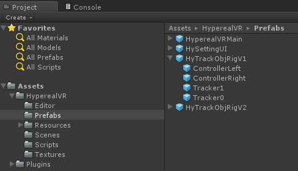
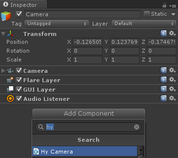
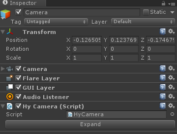
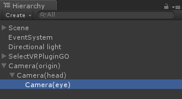
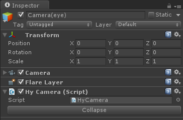
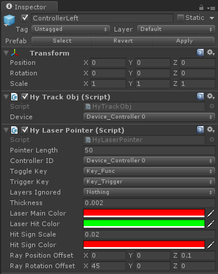
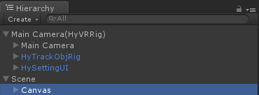
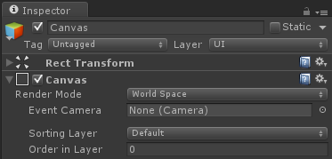
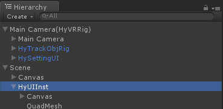
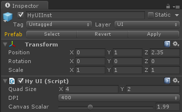

### Unity Plugin Programming Guide
<br>

#### HyperealVR Unity Plugin Programming Guide
1. There're two ways to add HyperealVR support:
   1. Drag and drop the "HyperealVRMain" to the Hierarchy window to create a HyperealVR main instance and add your player move controller to this to move your character.
   
  2. Select your gmaeobject which you want to used as VR camera and add HyCamera script:
   
   Then click the Expand button:
   
   The Expand operation will change your game object to support VR.
   
   Click the "Collapse" button on the Camera(Rig) object can reverse the Expand operation.
   
2. You can skip 3 ~ 4 topic if you’re intending to use Hypereal VR without position tracking. You can use: HyperealVR.Instance.IsTrackingEnabled to get whether the position tracking is enabled or not
3. You can add HyTrackObjRig.prefab to your scene to get a quick access of hypereal models.
4. Add your input pointer. We provide two kinds of input pointer: Laser Pointer, Touch Pointer 

5. Add your UI in VR.
  1. You can use the native UGUI with the Canvas' render mode set to World Space. 
   
   
  2. You can also create an empty game object and add the HyUI component which provides a world space UGUI solution with performance optimized. 
   
   
  Note: there is a known bug from Unity (Version 5.1, 5.2, 5.3) which will cause Unity Editor to crash when render ui to texture.
  http://forum.unity3d.com/threads/anyone-know-what-this-error-means-m_size-k_reference_bit.388339/
  https://issuetracker.unity3d.com/issues/after-multiple-m-size-k-reference-bit-errors-unity-crashes-at-fullparameterpreparer-onpreparetexture

<br>

#### Advance Topics

##### **APIs**:

``HyperealVR`` is an instance that provides most of the functions that developer can use, so check the ``HyperealVR.cs``.

<br>

##### **Get HMD/Controller Pose**: 

You can get the tracking pose of the HMD and controllers by either add HyTrackObj component to a game object or just use ``HyperealVR.Instance.GetTrackingState()``.

<br>

##### **Retrived/Send Custom message**:

We provide event ``OnHyMessage`` to retrieve message like quit, focus, status, ipd changed etc. from the SDK runtime. You can refer the usage in HyperealPlugin.cs and UpdateMsg at HyperealVR.cs.

<br>

##### **Check Hypereal VR System**:

Integrate with other VR plugin(like OpenVR, Oculus). Use HyperealVR.IsHyperealPresent to check whether the Hypreal VR device is current plugin or not, then chose which VR plugin you should toggle on. See ``SelectVRPluginDemo.cs`` for a practice.

<br>

##### **Multi-camera**:

You can use multi-camera just like the normal camera. You can switch between cameras and use layer to manage the scene. Note that when you set layer of a HyCamera, make sure you're making change to the camera with suffix of '(eye)'.

<br>

##### **Default Setting UI**:

  We provide a default setting UI that can be opened by pressing 'M' on keyboard or the menu button on left controller. It can be enabled by ``HyperealVR.Instance.EnableSettingUI(true)``.

<br>

##### **Mirror Type**:

 You can set ``HyperealVR.Instance.MirrorType`` and ``HyperealVR.Instance.MirrorMode`` to change the mirror window.

<br>

##### **Loading Helper**:

We provide a simple loading helper in case the game not submit frames while loading a new scene.

The usage of this helper is really simple : 

You just need call the ``Begin(string levelName, Texture2D loadingTex)`` when you need load a new scene.

``` 
{
  // Start loading...
  Texture2D tex = Resource.Load("TexPathHere");
  Hypereal.HyLoadingHelper.Begin("newScene", tex);
}
```