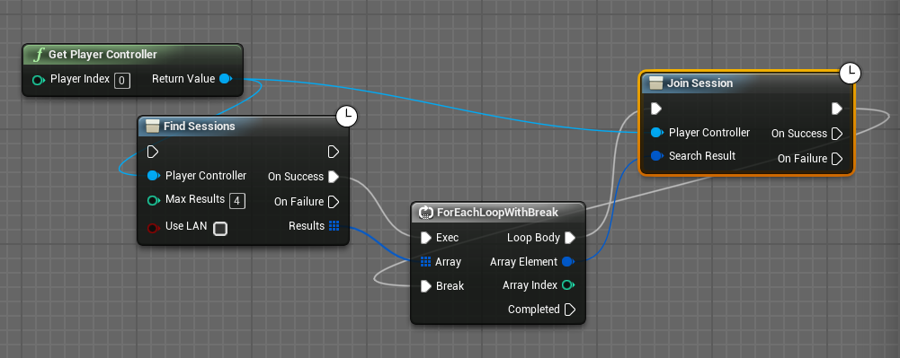
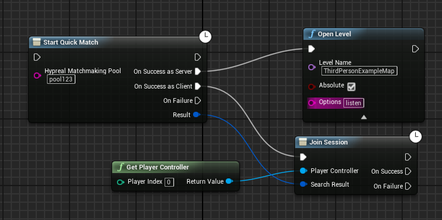
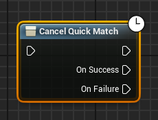

### Rooms and Matchmaking 
<br>

Users can play together through rooms and matchmaking.

#### NetWork

To provide the network communication for users in the same room or in a match , the following config should be add to the DefaultEngine.ini of project:

```
[/Script/Engine.GameEngine]
+NetDriverDefinitions=(DefName="GameNetDriver",DriverClassName="OnlineSubsystemHypereal.HyperealNetDriver",DriverClassNameFallback="OnlineSubsystemUtils.IpNetDriver")
      
[/Script/OnlineSubsystemHypereal.HyperealNetDriver]
NetConnectionClassName="OnlineSubsystemHypereal.HyperealNetConnection"

```

#### Unique Id

Before you use the following Unreal blueprints and Hypereal blueprints , you may need to set the Unique Id of the PlayerState, otherwise any blueprints will return false immediately.
If you do not want to do this with C++ , you can use call the ```Get Hypereal Identity blueprint``` first , and call ```Set Player Unique Id``` after the former return success.
Example:


#### Rooms

Developers can access features of rooms through Online Session Nodes in Unreal.

1) Create Room
The Create Session node is used to create and host a room. After the room was created , the current user's computer should become the listen server.
The Public Connections is used to set the max count of users in room , and the LAN mode is never used.

Example:


2) Find Room 
The Find Sessions node is used to get a list of rooms that are currently being joinable.

3) Join Room

After the call of Find Sessions , pass one of the search resullt to the Join Session node to join room , the game will automatically travel to the server's map if it successfully connects to the server.

Example:


For more information,see Unreal's [Online Session Nodes](https://docs.unrealengine.com/latest/INT/Engine/Blueprints/UserGuide/OnlineNodes/).

#### MatchMaking

Hypereal Platform currently support quick match for two users. Two Blueprints are available.

1) Enqueue Quick Match

Call the Start Quick Match node , after two users are matched , the program should do corresponding call for server or client.

The pool name represents a type of game mode or a map in your game.You can create your matchmaking pool in Hypereal Developer Center.

Example:


2) Cancel Quick Match

Call the Cancel Quick Match node.


#### Note

Unreal do not use custom net driver when play game with eidtor , so you need to test multiplayer game with launching game or packaged game with two or more computer.

#### Known Issue

1) Session with Lan is not supported currently.

2) The Destroy Session Blueprint Node will not return result if there is no matched session.

