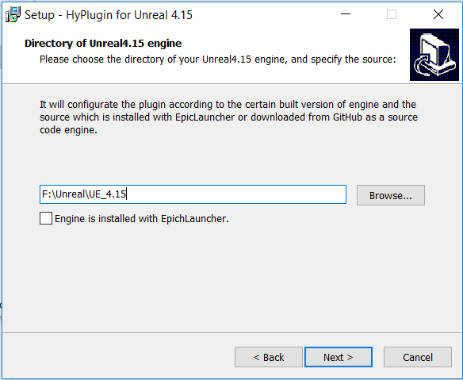

### UE Source Code User
 

#### Install HyperealVR Plugin Manually

1.Select the corresponding version for your unreal engine and extract the released archive
  

2.Copy and Paste the HyperealVR folder in extracted ThirdParty folder to your Unreal ThirdParty Source Directory , such as UE4.13\Engine\Source\ThirdParty ( please delete any previous version first )
  

3.Copy and Paste the HyperealVR folder in extracted Plugin folder to your Unreal Plugins Directory , such as Unreal\UE4.13.x\Engine\Plugins\Runtime ( if an old version exits, please delete it first )
  

4.Regenerate project files and build the UE project. (If a new version of HyperealVR plugin is installed, you might need to redo this step)
  

#### Install HyperealVR Plugin with a installer package

We also provide an installer for each supported version of Unreal Engine for both of source code engine and the one installed by Epic Launcher. Just please follow the wizard of the installer.

1.Install the corresponding plugin installer.

 

2.Choose the Install target location, unreal engine or app project.

3.Please browse to the engine path manually, don't check "Engine is installed with EpicLauncher".. 

4.If choose to install App project, you need to browse to the project path in this step.

  
5.Regenerate project files and build the UE engine project if installed to unreal engine or app project if installed to a C++ APP project.

